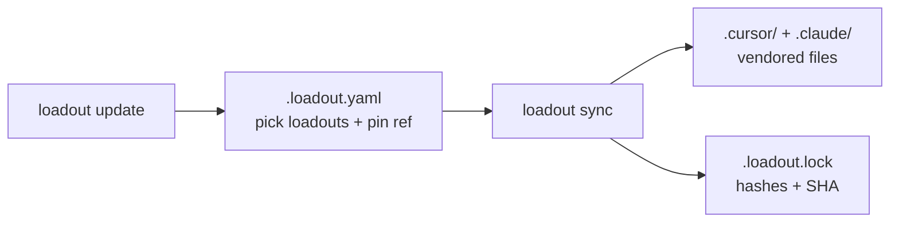

<p align="center">
  
</p>

# Loadout

[](https://github.com/sazlin/loadout/actions/workflows/ci.yml)
[](https://github.com/sazlin/loadout/releases)
[](https://www.python.org/downloads/)
[](LICENSE)
[](https://docs.astral.sh/uv/)

**Pack Cursor rules, Claude Code skills, agents, hooks, and MCP configs into named loadouts — then sync a reviewable copy into every project.**

No global install required. One manifest (`.loadout.yaml`), one lockfile, copy-pasteable commands.



## Table of contents

- [Quick start](#quick-start)
- [Change selected loadouts](#change-selected-loadouts)
- [Pull loadout changes over time](#pull-loadout-changes-over-time)
- [Check for drift](#check-for-drift)
- [Available loadouts](#available-loadouts)
- [Manifest cheatsheet](#manifest-cheatsheet)
- [After syncing](#after-syncing)
- [Project `just` recipes](#project-just-recipes)
- [Notes and warnings](#notes-and-warnings)
- [Local development](#local-development)
- [Documentation](#documentation)
- [License](#license)

## Quick start

Requires [uv](https://docs.astral.sh/uv/) (for `uvx`). Run these from any project directory.

**1. Initialize a manifest** — choose the loadouts you want:

```bash
uvx --from git+https://github.com/sazlin/loadout@main loadout init --loadouts base,python
```

**2. Sync** — vendor rules, skills, agents, hooks, and MCP configs into the repo:

```bash
uvx --from git+https://github.com/sazlin/loadout@main loadout sync
```

**3. Commit the result** — teammates and CI get the same files with no extra setup:

```bash
git add .loadout.yaml .loadout.lock .cursor .claude .mcp.json
git status   # also stage AGENTS.md / CLAUDE.md if sync touched them
git commit -m "Add loadout-managed agent tooling"
```

Pin a release tag instead of `main` once you want a fixed upgrade cadence:

```bash
uvx --from git+https://github.com/sazlin/loadout@v0.5.0 loadout sync
```

`init` writes a starter `.loadout.yaml` like:

```yaml
source: https://github.com/sazlin/loadout
ref: main
loadouts:
  - base
  - python
```

## Change selected loadouts

Edit `.loadout.yaml` — the `loadouts:` list is the only control surface you need day to day.

```yaml
source: https://github.com/sazlin/loadout
ref: main
loadouts:
  - base
  - python
  - terraform   # add
  # - aws       # remove by deleting the line
```

Then re-sync and commit the diff:

```bash
uvx --from git+https://github.com/sazlin/loadout@main loadout sync
# or, if your project justfile has the consumer recipes:
just loadout-sync
```

Preview what a manifest resolves to before writing:

```bash
uvx --from git+https://github.com/sazlin/loadout@main loadout resolve --list
# or: just loadout-list
```

Optional fine-tuning (rarely needed):

```yaml
include:
  - rules/core/commit-style.mdc
exclude:
  - skills/release-checklist
```

## Pull loadout changes over time

When this repo ships new rules/skills (or you want a newer pin), bump the manifest ref and re-sync.

**Recommended — one command:**

```bash
uvx --from git+https://github.com/sazlin/loadout@main loadout update
# or: just loadout-update
```

`update` rewrites `ref:` to the latest release tag (or `--to vX.Y.Z`), re-runs `sync`, and prints the CHANGELOG entries that landed.

**Manual alternative:**

```yaml
# .loadout.yaml
ref: v0.5.0   # was: main or an older tag
```

```bash
uvx --from git+https://github.com/sazlin/loadout@v0.5.0 loadout sync
```

Commit `.loadout.yaml`, `.loadout.lock`, and the generated tree so the upgrade is reviewable in PRs.

## Check for drift

Fail CI (or a local check) if someone hand-edited vendored files or the lock is stale:

```bash
uvx --from git+https://github.com/sazlin/loadout@main loadout sync --check
# or: just loadout-check
```

Example GitHub Actions step:

```yaml
- name: Verify agent rules and skills
  run: just loadout-check
```

## Available loadouts

| Loadout | Extends | What you get |
| --- | --- | --- |
| `base` | — | Core conventions, release checklist skill, deny-dangerous hook, davinci agent, Context7 MCP |
| `python` | `base` | Python code style + pytest rules, python_coder agent |
| `python-monorepo` | `python` | UV workspace rules + db-migrations skill |
| `typescript` | `base` | TypeScript code style rules |
| `terraform` | `base` | Terraform/AWS conventions (scoped under `infra/`) + plan-review skill |
| `aws` | `base` | AWS Knowledge MCP |
| `playwright-e2e` | `base` | Playwright e2e rules (scoped under `e2e/`) + e2e test generator agent |
| `agents` | `base` | LangChain docs MCP for live LangChain / LangGraph / LangSmith lookup |
| `superpowers` | — | Opt-in Superpowers skills + SessionStart hook (see [warnings](#notes-and-warnings)) |

Compose freely — for example `base,python-monorepo,terraform` or `base,typescript,playwright-e2e`.

## Manifest cheatsheet

| Field | Required | Purpose |
| --- | --- | --- |
| `source` | yes | Loadout git URL (default: this repo) |
| `ref` | yes | Branch or tag pin (`main`, `v0.5.0`, …) |
| `loadouts` | yes | Named loadouts to compose |
| `include` / `exclude` | no | Extra / removed paths after composition |
| `skills_dir` / `hooks_dir` / `agents_dir` | no | Override sync destinations |

Full format: [loadout-spec.md](loadout-spec.md).

## After syncing

Rules, skills, agents, hooks, and MCP configs are files on disk. Agents do not always pick them up until reload:

- **Cursor IDE:** Command Palette → “Developer: Reload Window”. Authenticate any OAuth MCP servers under Settings → Tools & MCP if prompted.
- **Claude Code:** restart the session (or start a new one in the project root) so it rescans `.claude/skills/` and `.mcp.json`.

## Project `just` recipes

Generated / consumer projects typically wire these into their `justfile` (see [docs/consumer-contract.md](docs/consumer-contract.md)):

| Recipe | Equivalent |
| --- | --- |
| `just loadout-sync` | `loadout sync` |
| `just loadout-check` | `loadout sync --check` |
| `just loadout-update` | `loadout update` |
| `just loadout-list` | `loadout resolve --list` |

Each recipe runs `uvx` against the `source` / `ref` pinned in `.loadout.yaml`, so the CLI version matches the content version.

## Notes and warnings

<details>
<summary><strong>Agents loadout</strong> — LangChain docs MCP</summary>

The `agents` loadout extends `base` and adds the LangChain docs MCP
(`https://docs.langchain.com/mcp`) so agents can search live LangChain /
LangGraph / LangSmith documentation:

```yaml
loadouts: [agents]
```

</details>

<details>
<summary><strong>Superpowers loadout</strong> — do not combine with the plugin</summary>

The `superpowers` loadout is opt-in. Add it when you want the vendored
Superpowers skills and SessionStart bootstrap **without** installing the plugin:

```yaml
loadouts: [base, python-monorepo, superpowers]
```

Enable it only on machines that do **not** have the Superpowers plugin installed
for Cursor and/or Claude Code on that project. Combining plugin + loadout causes
double SessionStart bootstrap and duplicate skills. Prefer plugin **or** loadout,
not both.

</details>

## Local development

When hacking on this repo, point sync at your working copy instead of cloning from GitHub:

```bash
LOADOUT_PATH="$(pwd)" just -f /path/to/project/justfile loadout-sync
# or from a project directory:
LOADOUT_PATH=/path/to/loadout loadout sync
```

The lockfile records `"resolved_sha": "local"`.

Repo commands:

```bash
uv sync --all-extras
just lint     # validate rules, skills, hooks, agents, mcps, loadouts
just test     # pytest
just release 0.3.0   # on release/v0.3.0: validate, push, open PR; CI tags on merge

# Import a third-party skill into skills/ (then wire it into a loadout YAML)
just add_skill mattpocock/skills --skill grill-me
```

Repo-local skills for agents working *on this repository* live under
`.claude/skills/` (committed; not part of any consumer loadout). Example:
`skill-security-check` for auditing candidate skills before they land in `skills/`.

## Documentation

- [loadout-spec.md](loadout-spec.md) — full specification
- [docs/consumer-contract.md](docs/consumer-contract.md) — cookiecutter hook and project `justfile` contract
- [CHANGELOG.md](CHANGELOG.md) — release notes

## License

[MIT](LICENSE) © Sean Azlin
